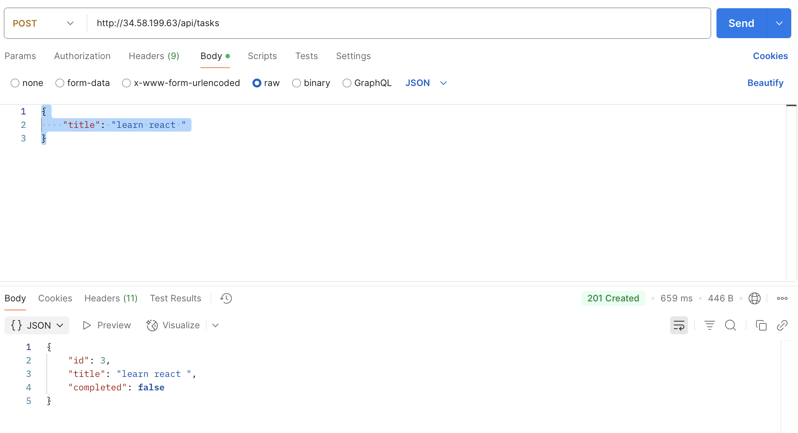

Les etapes de déploiement :

  Créer une machine virtuelle Ubuntu 
  
  Installer les dépendances nécessaires (Node.js, npm, SQLite , etc.).
  Déployer le backend Express.js et le frontend React.js.
  Autoriser les ports nécessaires (ex. : 3000 pour Express, 80 ou 443 pour React) dans les règles de pare-feu afin de rendre les services accessibles publiquement.
  lier l’adresse IP publique de la machine à un nom de domaine pour un accès plus simple et professionnel
  
Les Technologies utilisées :

  Frontend : React
  Backend : Express.js
  Base de données : SQLite

// test api de récupérer une tâche spécifique

// test api de créer une nouvelle tâche

