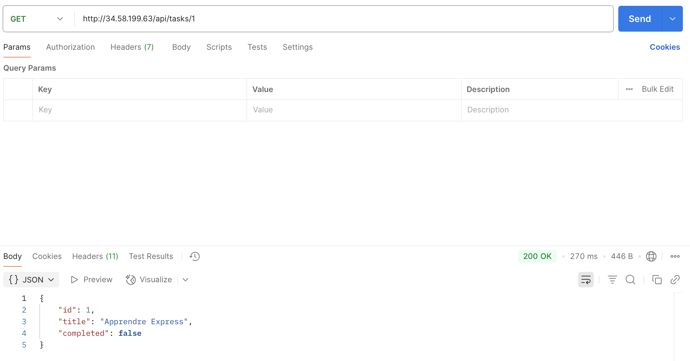

Les etapes de déploiement :

 &nbsp;&nbsp; Créer une machine virtuelle Ubuntu 
  
 &nbsp;&nbsp; Installer les dépendances nécessaires (Node.js, npm, SQLite , etc.).
  
 &nbsp;&nbsp; Déployer le backend Express.js et le frontend React.js.
  
  &nbsp;&nbsp; Autoriser les ports nécessaires (ex. : 3000 pour Express, 80 ou 443 pour React) dans les règles de pare-feu afin de rendre les services accessibles publiquement.
  
 &nbsp;&nbsp; lier l’adresse IP publique de la machine à un nom de domaine pour un accès plus simple et professionnel

Schéma du Projet:
```plaintext
app_to_do-tp/
├── public/                    # Fichiers publics pour React
│   └── index.html             # Page HTML principale
├── src/                       # Code source React (frontend)
│   ├── api.js                 # Appels API vers Express
│   ├── App.js                 # Composant principal React
│   ├── components/            # Composants React personnalisés
│   │   ├── Header.js
│   │   └── TaskItem.js
│   └── index.js               # Point d'entrée de l'app React
├── database.db                # Base de données SQLite
├── server.js                  # Serveur Express (backend)
├── package.json               # Dépendances et scripts du projet
├── package-lock.json          # Lockfile npm
└── README.md                  # Documentation du projet
```

  
Les Technologies utilisées :

  &nbsp;&nbsp; Frontend : React
  
  &nbsp;&nbsp; Backend : Express.js
  
 &nbsp;&nbsp; Base de données : SQLite

// test api de récupérer une tâche spécifique



// test api de créer une nouvelle tâche


